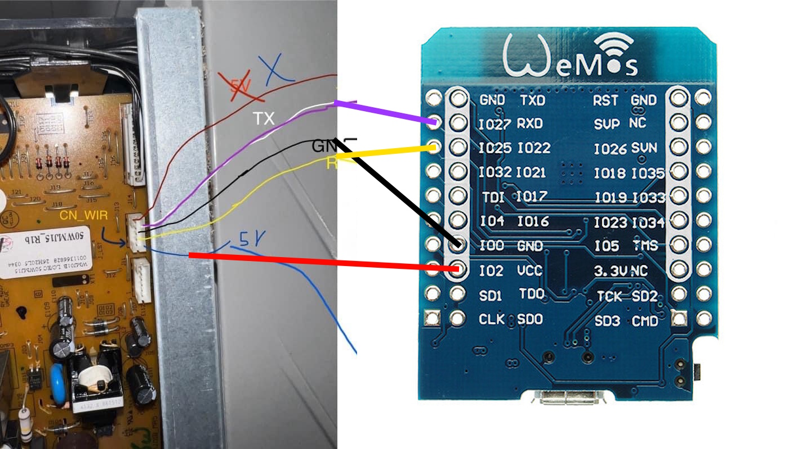
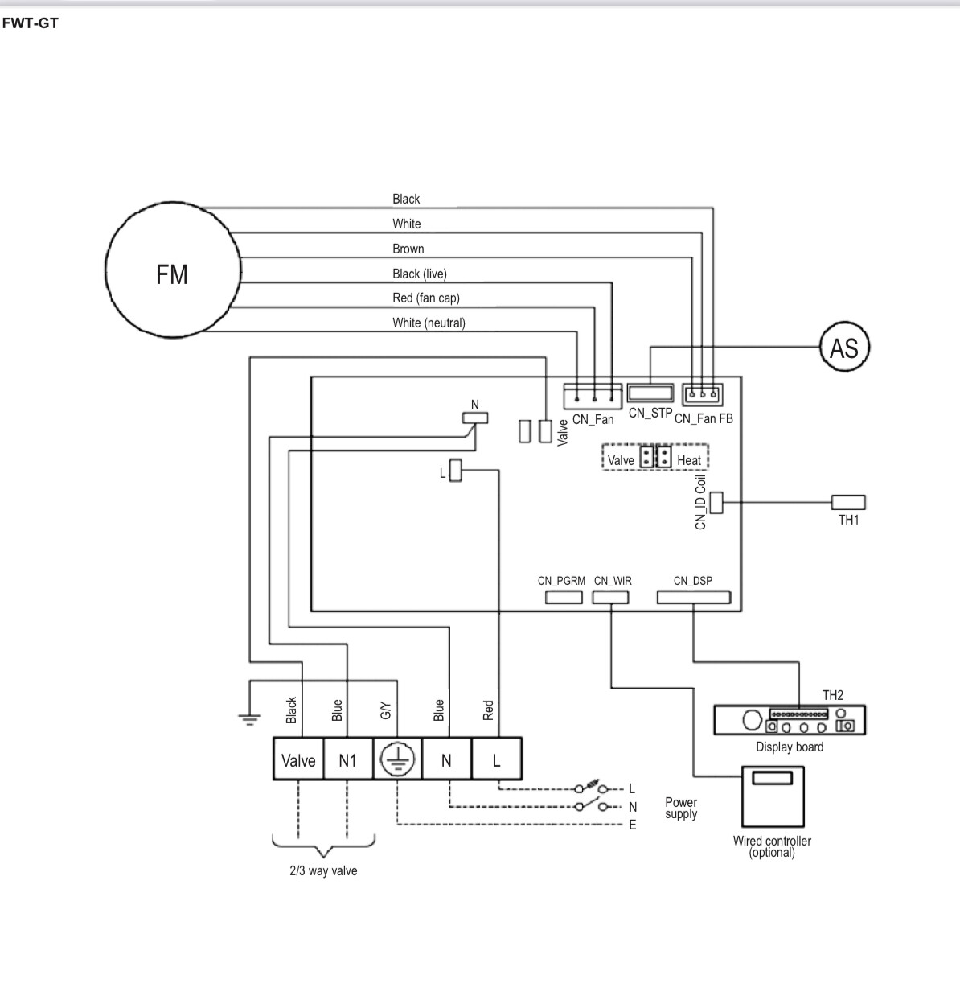

## Hardware

The **Daikin CN-Wired ESPHome component** requires an ESP32-based board connected to the CN-Wired bus of the Daikin indoor unit.

### Recommended hardware

For this project, I use an **ESP32 D1 Mini**.

Tested on climate FWT04GATNMV1 FWT-GT.

The communication with the Daikin CN-Wired bus is handled using software RX/TX pins:

* **RX:** GPIO25
* **TX:** GPIO27

No level shifter is required for this setup.

### Wiring

The following diagrams show the recommended wiring between the ESP32 D1 Mini and the Daikin CN-Wired interface.

The CN-Wired connector and its position on the FWT-GT control board are shown below:

> **Note:** The RX and TX pins are software-configurable, so different GPIOs can be used if required by your hardware setup. The examples in this project use GPIO25 and GPIO27.

### Hardware overview

| Component     | Description         |
| ------------- | ------------------- |
| ESP32 board   | ESP32 D1 Mini       |
| RX            | GPIO25              |
| TX            | GPIO27              |
| Level shifter | **Not required**    |
| Communication | Daikin CN-Wired bus |

The ESP32 communicates directly with the CN-Wired interface, without an external level-shifting circuit.
